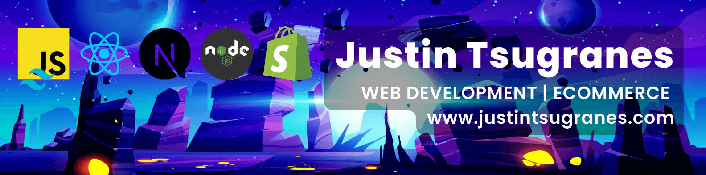

  

  <h1>Hi, I'm Justin</h1>
  <h3>Frontend Engineer · eCommerce · React & TypeScript</h3>

  

    <a href="https://www.tsugranes.com" target="_blank" rel="noreferrer">Site</a>
    &nbsp;•&nbsp;
    <a href="https://www.tsugranes.com/projects" target="_blank" rel="noreferrer">Projects</a>
    &nbsp;•&nbsp;
    <a href="mailto:justin@tsugranes.com">Email</a>
  

  

    
    &nbsp;
    
  

  
  

 

<h2>About Me</h2>

I'm a Frontend Engineer at <strong>Fender Musical Instruments Corporation</strong>, working on multi-brand eCommerce for sites like Fender, Jackson, and PreSonus. I spend most of my time in React, TypeScript, Shopify, and Contentful, building shared components and features that support global storefronts and help the business move faster without sacrificing stability.

Recently, I helped replatform several brands from SFCC to a Shopify & Contentful stack, contributing to meaningful platform cost reductions and a more flexible foundation for future development.

I've been playing Fender instruments since I was a kid, so getting to work on the digital side of the brand now is very much a full-circle experience.

Before engineering, I spent 13 years as a guitarist in the U.S. Army National Guard Band, alongside roles in operations and commercial production—experience that shows up in my work as calm execution, clear communication, and comfort taking responsibility when stakes and timelines are high.

 

<h3>Currently</h3>

- Building and maintaining multi-brand eCommerce storefronts using React, TypeScript, Shopify, and Contentful
- Developing shared component libraries and features that support global storefronts, improving development velocity and consistency
- Contributing to platform architecture decisions that balance modern tooling with long-term maintainability
- Implementing new features and ensuring seamless operation of e-commerce sites for a global customer base

 

<h3>Outside of Tech</h3>

When I'm not writing code, I'm usually:

- spending time with family
- playing guitar and writing music
- learning how to sail
- playing backgammon
- shooting photos
- going to live shows and events
- hiking, camping, backpacking, trail-running, or road-tripping
- working through non-fiction books, audiobooks, podcasts, and standup comedy
- snorkeling/diving whenever I get the chance

Thanks for stopping by.

 

<h2>On This GitHub</h2>

Here you'll find:

- **Frontend experiments** – small apps and components built with React/Next.js.
- **eCommerce-related projects** – demos exploring product browsing, carts, and CMS integrations.
- **Learning projects** – things created while exploring APIs, patterns, or new frameworks.
- **Odds and ends** – small utilities or ideas that were worth saving.

If you have questions or want context on a repo, feel free to open an issue or reach out.

 

<h2>Tech Stack</h2>

<h3>Languages</h3>

<h3>Frameworks, Platforms & Services</h3>

<h3>Backend & Data</h3>

<h3>Operating System & Tools</h3>

<h3>UX/UI & Design</h3>

 

<h2>GitHub Stats</h2>

 

  

 

<h2>Support</h2>

If you've found something here useful or interesting:

