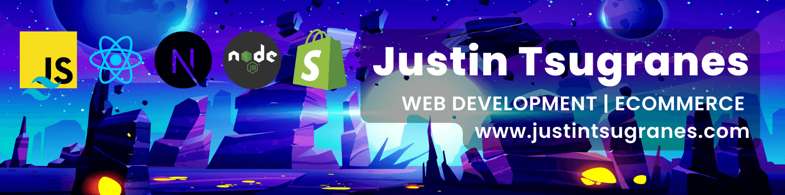

  

  <h1>Justin Tsugranes</h1>
  <h3>Full-Stack Engineer &nbsp;·&nbsp; AI Systems &nbsp;·&nbsp; Founder, Total Ventures</h3>

  

    <a href="https://www.justintsugranes.dev" target="_blank" rel="noreferrer">Site</a>
    &nbsp;•&nbsp;
    <a href="https://www.justintsugranes.dev/projects" target="_blank" rel="noreferrer">Projects</a>
    &nbsp;•&nbsp;
    <a href="mailto:hello@justintsugranes.dev">Email</a>
  

  
  &nbsp;
  

  

 

## About

I run [Total Ventures](https://totalventures.io), a product studio where I build digital products on shared AI infrastructure.

I built [Inky](https://inkyverse.io) because I wanted better bedtime stories for my 2-year-old son. It's now a production AI platform — native iOS app, Gemini-powered story generation, word-level narration, global story library. That's roughly how I approach most things.

Previously a frontend engineer at Fender, where I shipped multi-brand eCommerce across Fender, Jackson, and PreSonus — and built LEO, an internal Claude-powered CLI that automated Jira workflows end-to-end. 13-year Army veteran.

Open to engineering roles at small teams moving fast.

 

## What I'm Building

**[Inky](https://inkyverse.io)** — AI storytelling app for kids. iOS + web + Firebase. Multi-stage Gemini + Imagen 4 pipeline, SwiftUI with word-level narration, RevenueCat + Stripe.

**[Pregnancy Power Hour](https://pregnancypowerhour.com)** — Consulting platform with a Claude-powered content pipeline. One video becomes a week of content: blog, newsletter, social, email sequences.

**[Total Formula 1 World](https://totalformula1world.com)** — Automated media property. RSS → Gemini summarization → AdSense-monetized site + newsletter. Blueprint for a scalable content network.

**VERA** — Production multi-agent engineering system. 24 custom skills, 4 specialist agents, Go CLI managing deployments, analytics, ads, and finance from a single terminal binary.

 

## On This GitHub

Most of Total Ventures runs in a private monorepo — Turborepo, pnpm, 11 shared TypeScript packages, 14 CI workflows. Public repos here are experiments, open tooling, and things worth sharing.

 

## Tech Stack

### Languages

### Frameworks & Platforms

### AI

### Commerce & Integrations

### Tools

 

## GitHub Stats

 

  

